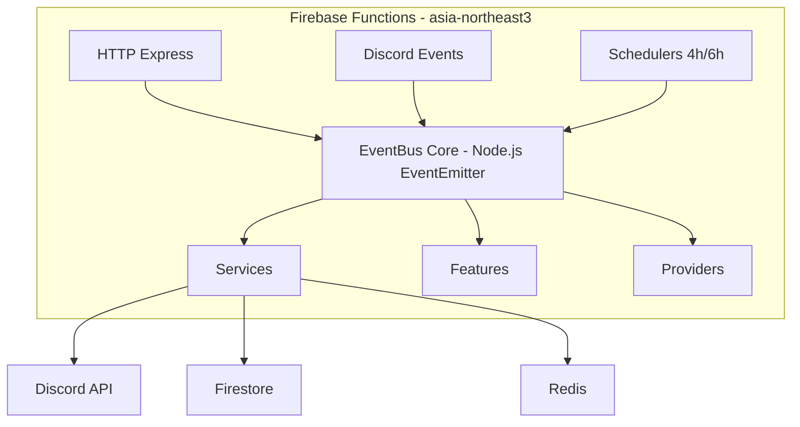
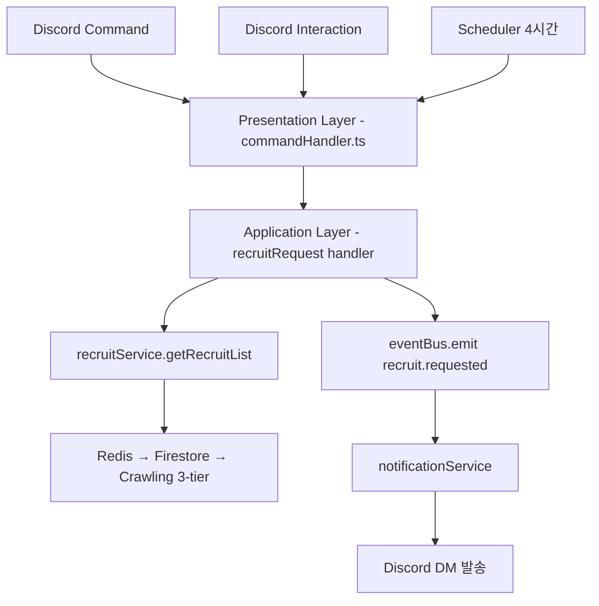
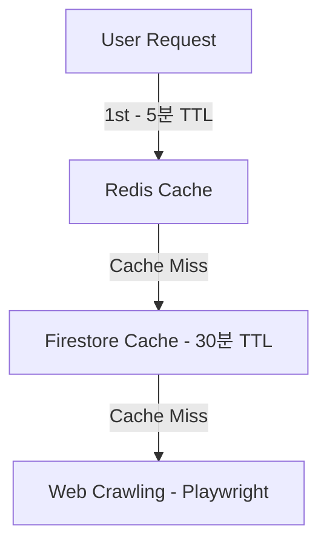

# 아키텍처 개요

> 사람인 에이전트 Discord Bot - Event-Driven Architecture

---

## 시스템 아키텍처

### High-Level Overview



---

## 계층 구조 (Layered Architecture)

### 1. Presentation Layer (events/)

**역할**: 외부 요청을 받아 적절한 핸들러로 라우팅

```
events/
├── interactionCreate/     # Discord 상호작용 이벤트
│   ├── commandHandler.ts  # Slash Command 처리
│   ├── buttonHandler.ts   # 버튼 클릭 처리
│   └── modalHandler.ts    # 모달 제출 처리
└── ready/
    └── readyHandler.ts    # Bot 준비 완료
```

**책임**:
- Discord 이벤트 수신
- 요청 검증
- 적절한 Feature로 위임

---

### 2. Application Layer

#### EventBus (eventBus/)

**역할**: 비즈니스 이벤트의 중앙 허브 (Singleton, Node.js EventEmitter 기반)

**이벤트 도메인**:
- **Recruit**: 크롤링, 새 공고, 공고 요청
- **Notification**: 구독, 알림 발송
- **System**: 에러 처리 및 로깅
- **Admin**: 관리자 기능
- **Proxy**: 프록시 순환

#### Services (services/)

**역할**: 핵심 비즈니스 로직

```
services/
├── recruitService.ts          # 공고 조회 로직
├── recruitCacheService.ts     # 공고 캐싱 및 변경 감지
├── notificationService.ts     # 알림 발송 로직
├── errorReportService.ts      # 에러 리포팅
└── aiService.ts               # AI 자연어 처리
```

#### Features (features/)

**역할**: 사용자 기능 모듈 (독립적)

```
features/
├── alarmSubscribe/       # 알림 설정 기능
├── recruitRequest/       # 공고 요청 기능
├── notification/         # 알림 발송 기능
├── errorReporting/       # 에러 리포팅 기능
└── adminBroadcast/       # 관리자 공지 기능
```

**Feature 내부 구조**:
```
alarmSubscribe/
├── commands/            # Slash Command 정의
├── interactions/        # UI 컴포넌트 (버튼, 모달)
├── handlers/            # 이벤트 핸들러
├── services/            # Feature별 비즈니스 로직
└── types/               # 타입 정의
```

---

### 3. Integration Layer

#### Providers (providers/)

**역할**: 외부 서비스 통합

```
providers/
├── discord/
│   └── utils/
│       └── dmSender.ts          # Discord DM 발송
│
├── firebase/
│   └── store/
│       ├── subscription.ts      # 알림 설정 저장소
│       ├── errorLog.ts          # 에러 로그 저장소
│       ├── broadcast.ts         # 공지 이력 저장소
│       └── aiCache.ts           # AI 캐시 저장소
│
└── ai/
    └── huggingface/
        ├── client.ts            # HF API 클라이언트
        ├── models.ts            # 모델 설정
        └── rateLimiter.ts       # Rate Limit 관리
```

#### Crawlers (crawlers/)

**역할**: 웹 크롤링 및 스케줄링

```
crawlers/
├── schedulers/
│   ├── base/
│   │   └── BaseScheduler.ts     # 스케줄러 기본 클래스
│   ├── RecruitScheduler.ts      # 공고 크롤링 (4시간)
│   └── ProxyScheduler.ts        # 프록시 갱신 (6시간)
│
└── recruit/
    └── RecruitCrawler.ts        # Playwright 크롤러
```

---

## Event-Driven Architecture

### 이벤트 흐름



### 이벤트 목록

**도메인별 이벤트**:
- **Recruit**: 크롤링 시작/완료/실패, 새 공고, 공고 요청
- **Notification**: 구독/구독해제, 알림 발송 시작/완료
- **System**: Critical/Failure/Warning 에러
- **Admin**: 전체 공지 요청/완료
- **Proxy**: 프록시 순환 성공/실패

---

## 데이터 흐름

### 3-Tier Caching Strategy



### 공고 변경 감지

SHA-256 해시 비교로 공고 목록 변경 감지 후 이벤트 발행

### Firestore 컬렉션

- **users/{userId}/notifications/settings** — 알림 설정 (지역, 모드)
- **errors/{errorId}** — 에러 로그
- **broadcasts/{broadcastId}** — 공지 이력
- **ai_nlp_cache/{cacheId}** — AI 의도 분석 캐시 (7일 TTL)

---

## 관련 문서

- [SystemLogger 가이드](./functions/src/common/utils/__docs__/SYSTEM_LOGGER_GUIDE.md)
- [SystemError 가이드](./functions/src/common/utils/__docs__/SYSTEM_ERROR_GUIDE.md)
